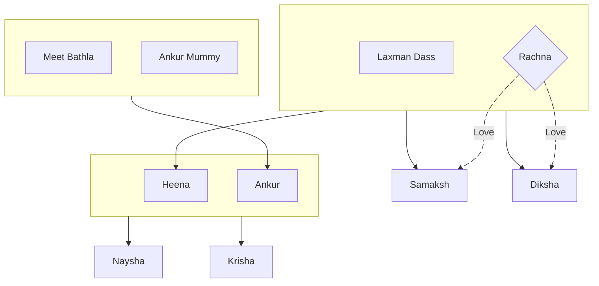
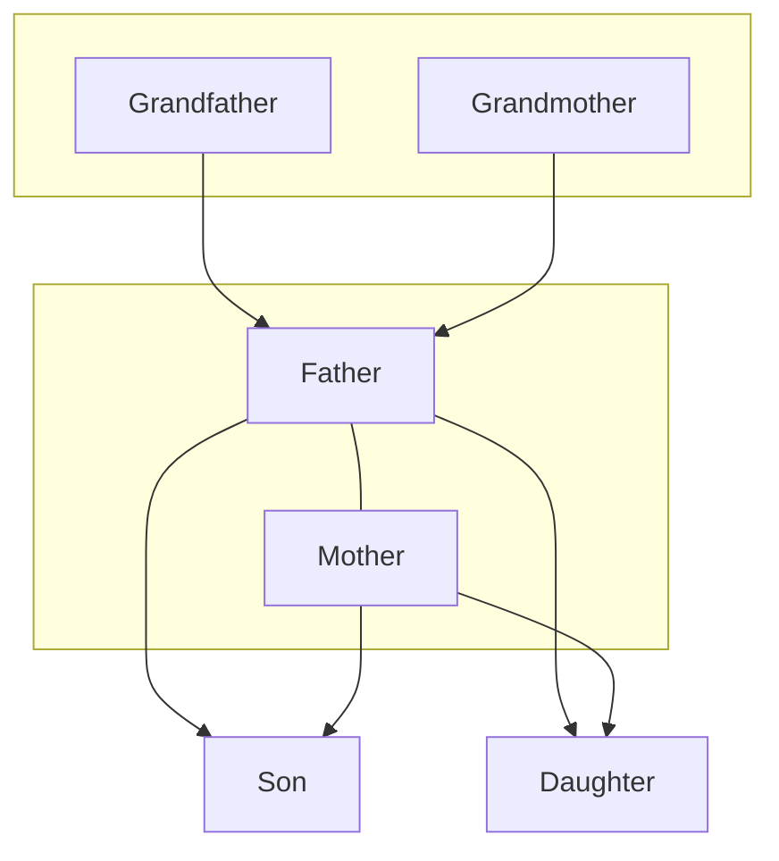
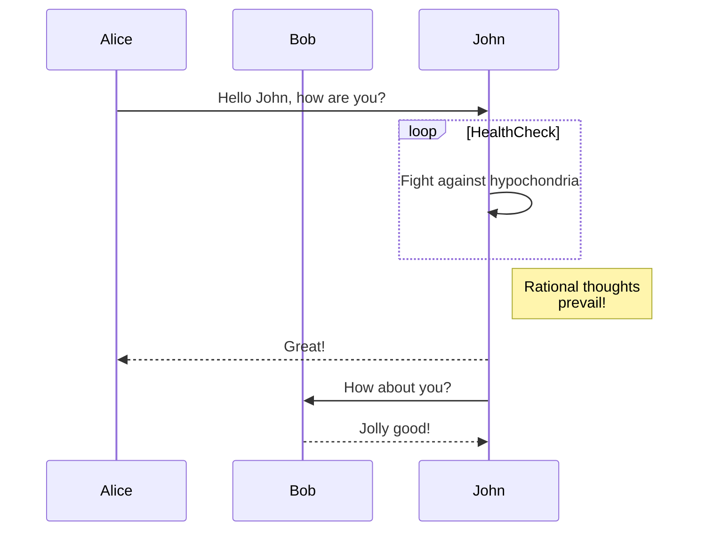

## This is a flow chart of UPI Cash point

```mermaid
graph
A{Rachna}
B[Heena]
C[Samaksh]
D[Diksha]
E[Ankur]
F[Naysha]
G[Krisha]
H[Meet Bathla]
I[Ankur Mummy]
J[Laxman Dass]


A e1@--> |Love| C
e1@{ animate: fast }

A e2@ --> |Love| D
e2@{animate: slow}


subgraph groverfamily [ ]
    direction TB
    J
    A
end

subgraph afamily [ ]
    direction TB
    H
    I
end

afamily --> E

subgraph hfamily [ ]
    direction TB
    B
    E
end

hfamily --> F
hfamily --> G

groverfamily --> B
groverfamily --> C
groverfamily --> D

```

```mermaid
graph TD
    subgraph Generation1[ ]
        direction LR
        GF[Grandfather]
        GM[Grandmother]
    end

    subgraph Generation2[ ]
        direction LR
        F
        M[Mother]
    end

    F --- M

    GF --> F[Father]
    GM --> F


    F --> S[Son]
    M --> S

    F --> D[Daughter]
    M --> D

```

```mermaid
sequenceDiagram
    participant Alice
    participant Bob
    Alice->>John: Hello John, how are you?
    loop HealthCheck
        John->>John: Fight against hypochondria
    end
    Note right of John: Rational thoughts <br/>prevail!
    John-->>Alice: Great!
    John->>Bob: How about you?
    Bob-->>John: Jolly good!
```
