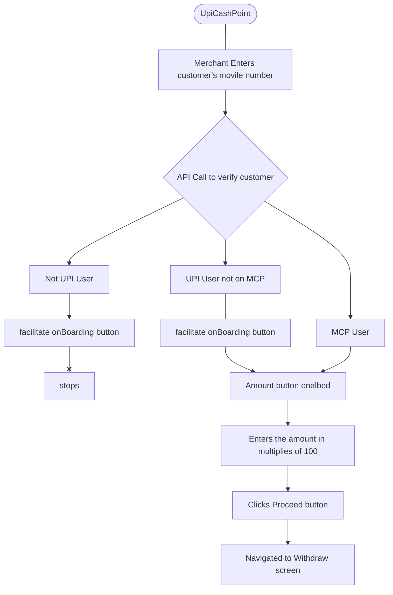
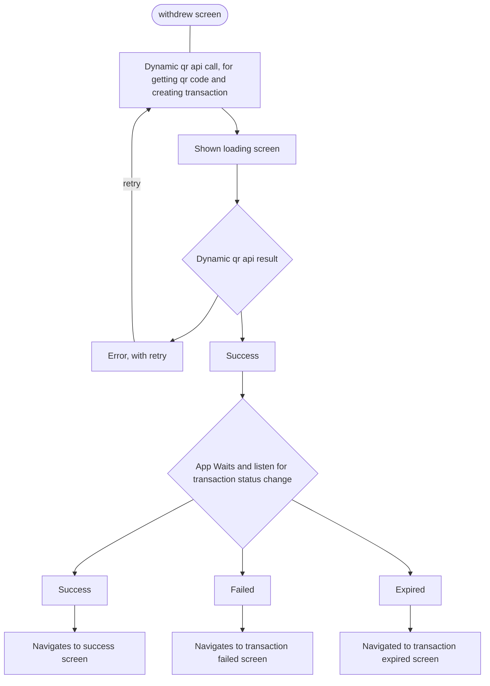
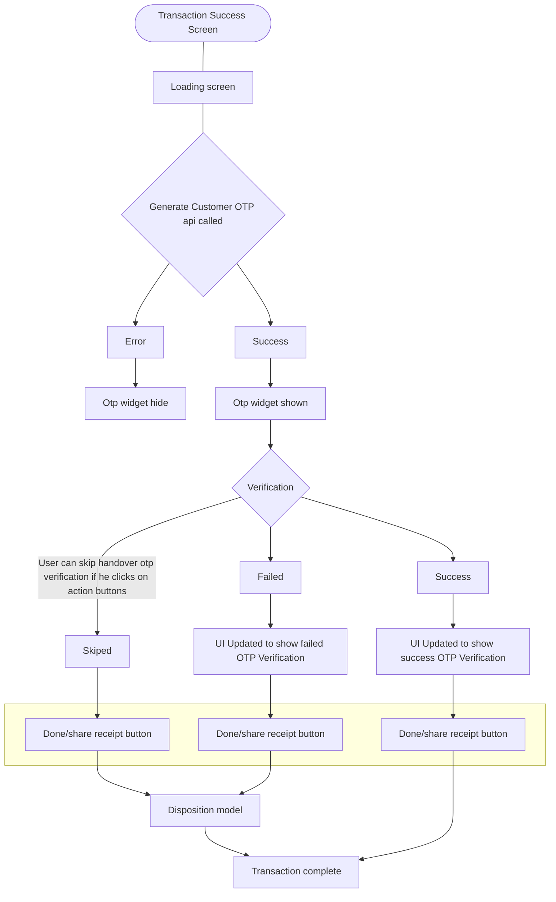

### UPI CashPoint

```mermaid
graph TB

A([UpiCashPoint])
B[Merchant Enters customer's movile number]
C{API Call to verify customer}
D[Not UPI User]
E[UPI User not on MCP]
F[MCP User] 

A --- B
B --> C

C-->D
C-->E
C-->F

D --> G[facilitate onBoarding button]
G --x H[stops]

E --- I[facilitate onBoarding button]
I --> J[Amount button enalbed]
F --> J

J --> K[Enters the amount in multiplies of 100]
K --> L[Clicks Proceed button]
L --> M[Navigated to Withdraw screen]

```

### Withdrew Screen

```mermaid
graph TB
A[Dynamic qr api call, for getting qr code and creating transaction]
B[Shown loading screen]
C{Dynamic qr api result}
D[Error, with retry]
F[Success]
G{App Waits and listen for transaction status change}
H[Success]
I[Failed]
J[Expired]
A1([withdrew screen])

A1 ---A
A --> B
B --> C
C --> D
C --> F

D -->|retry| A
F --> G

G --> H
G --> I
G --> J

J --> K[Navigated to transaction expired screen]
I --> M[Navigates to transaction failed screen]
H --> N[Navigates to success screen]

```

### Success screen

```mermaid
graph TB

A([Transaction Success Screen])
B[Loading screen]
C{Generate Customer OTP api called}
D[Error]
E[Success]
F[Otp widget hide]
G[Otp widget shown]

H{Verification}

K[Skiped]
I[Failed]
J[Success]

L[UI Updated to show failed OTP Verification]
M[UI Updated to show success OTP Verification]

N1[Done/share receipt button]
N2[Done/share receipt button]
N3[Done/share receipt button]

Q[Disposition model]
Z[Transaction complete]

subgraph Action [ ]
N1
N2
N3
end

A --- B
B --- C

C --> D
C --> E

D --> F
E --> G

G --> H

H -- User can skip handover otp verification if he clicks on action buttons ---> K
K --> N1


H --> I
I --> L
L --> N2

H --> J
J --> M
M --> N3

N1 --> Q
Q --> Z

N2 --> Q
N3 --> Z

```