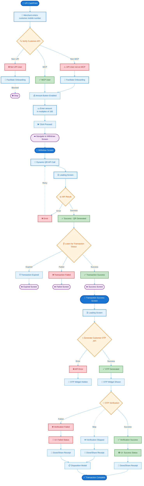

```mermaid
%%{init: {'theme':'base', 'themeVariables': { 'primaryColor':'#e3f2fd','primaryTextColor':'#1565c0','primaryBorderColor':'#1976d2','lineColor':'#42a5f5','secondaryColor':'#fff3e0','tertiaryColor':'#f3e5f5','fontSize':'16px'}}}%%

graph TB
    %% UPI CashPoint Flow
    Start([🔷 UPI CashPoint])
    Input[📱 Merchant enters customer mobile number]
    APICall{🔍 Verify Customer API}
    NonUPI[❌ Not UPI User]
    NonMCP[⚠️ UPI User not on MCP]
    MCPUser[✅ MCP User]
    Onboard1[🚀 Facilitate Onboarding]
    Onboard2[🚀 Facilitate Onboarding]
    Stop([⛔ Stop])
    AmtBtn[💰 Amount Button Enabled]
    EnterAmt[💵 Enter amount<br/>in multiples of 100]
    Proceed[▶️ Click Proceed]
    NavWithdraw([➡️ Navigate to Withdraw Screen])
    
    Start --> Input
    Input --> APICall
    APICall -->|Non-UPI| NonUPI
    APICall -->|Non-MCP| NonMCP
    APICall -->|MCP| MCPUser
    NonUPI --> Onboard1
    Onboard1 -.->|Blocked| Stop
    NonMCP --> Onboard2
    Onboard2 --> AmtBtn
    MCPUser --> AmtBtn
    AmtBtn --> EnterAmt
    EnterAmt --> Proceed
    Proceed --> NavWithdraw
    
    %% Withdraw Screen Flow
    WStart([🔷 Withdraw Screen])
    QRAPI[🔄 Dynamic QR API Call]
    Loading[⏳ Loading Screen]
    QRResult{📊 API Result}
    Error[❌ Error]
    QRSuccess[✅ Success - QR Generated]
    Listen{👂 Listen for Transaction Status}
    TxSuccess[✅ Transaction Success]
    TxFailed[❌ Transaction Failed]
    TxExpired[⏰ Transaction Expired]
    NavExp([➡️ Expired Screen])
    NavFail([➡️ Failed Screen])
    NavSuccess([➡️ Success Screen])
    
    NavWithdraw -.-> WStart
    WStart --> QRAPI
    QRAPI --> Loading
    Loading --> QRResult
    QRResult -->|Error| Error
    QRResult -->|Success| QRSuccess
    Error -.->|Retry| QRAPI
    QRSuccess --> Listen
    Listen -->|Success| TxSuccess
    Listen -->|Failed| TxFailed
    Listen -->|Expired| TxExpired
    TxExpired --> NavExp
    TxFailed --> NavFail
    TxSuccess --> NavSuccess
    
    %% Success Screen Flow
    SStart([🔷 Transaction Success Screen])
    SLoading[⏳ Loading Screen]
    OTPCall{📞 Generate Customer OTP API}
    OTPError[❌ API Error]
    OTPSuccess[✅ OTP Generated]
    HideOTP[🚫 OTP Widget Hidden]
    ShowOTP[📲 OTP Widget Shown]
    Verify{🔐 OTP Verification}
    Skipped[⏭️ Verification Skipped]
    VerifyFail[❌ Verification Failed]
    VerifySuccess[✅ Verification Success]
    UIFail[🔴 UI: Failed Status]
    UISuccess[🟢 UI: Success Status]
    Action1[📄 Done/Share Receipt]
    Action2[📄 Done/Share Receipt]
    Action3[📄 Done/Share Receipt]
    Disposition[📋 Disposition Modal]
    Complete([✅ Transaction Complete])
    
    NavSuccess -.-> SStart
    SStart --> SLoading
    SLoading --> OTPCall
    OTPCall -->|Error| OTPError
    OTPCall -->|Success| OTPSuccess
    OTPError --> HideOTP
    OTPSuccess --> ShowOTP
    ShowOTP --> Verify
    Verify -.->|Skip| Skipped
    Verify -->|Failed| VerifyFail
    Verify -->|Success| VerifySuccess
    Skipped --> Action1
    VerifyFail --> UIFail
    UIFail --> Action2
    VerifySuccess --> UISuccess
    UISuccess --> Action3
    Action1 --> Disposition
    Action2 --> Disposition
    Action3 --> Complete
    Disposition --> Complete
    
    classDef startEnd fill:#1976d2,stroke:#0d47a1,stroke-width:3px,color:#fff
    classDef process fill:#e3f2fd,stroke:#1976d2,stroke-width:2px,color:#1565c0
    classDef decision fill:#fff3e0,stroke:#f57c00,stroke-width:2px,color:#e65100
    classDef success fill:#c8e6c9,stroke:#388e3c,stroke-width:2px,color:#1b5e20
    classDef error fill:#ffcdd2,stroke:#d32f2f,stroke-width:2px,color:#b71c1c
    classDef navigation fill:#f3e5f5,stroke:#7b1fa2,stroke-width:2px,color:#4a148c
    
    class Start,WStart,SStart,Complete startEnd
    class Input,QRAPI,Loading,SLoading,EnterAmt,Onboard1,Onboard2 process
    class APICall,QRResult,Listen,OTPCall,Verify decision
    class MCPUser,QRSuccess,TxSuccess,OTPSuccess,VerifySuccess,UISuccess success
    class NonUPI,NonMCP,Error,TxFailed,OTPError,VerifyFail,UIFail error
    class NavWithdraw,NavExp,NavFail,NavSuccess,Stop navigation
```